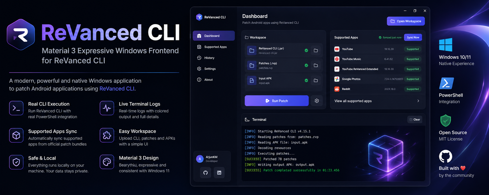
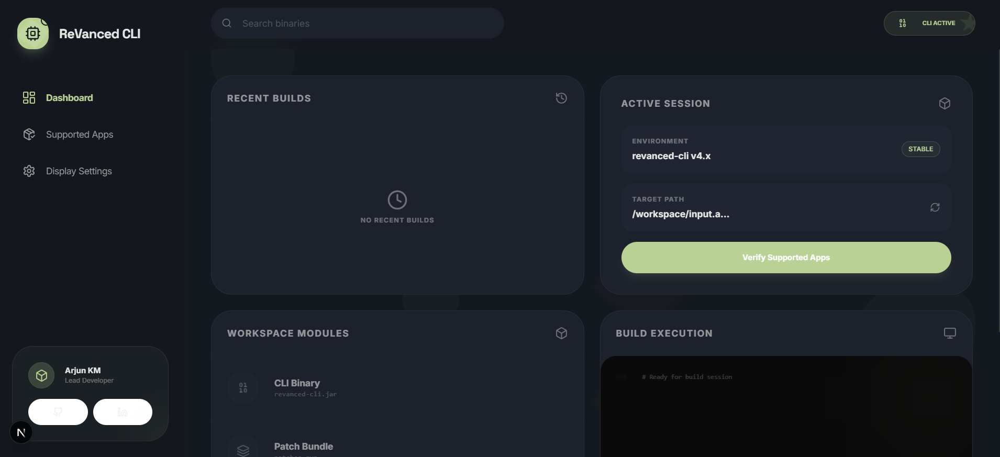
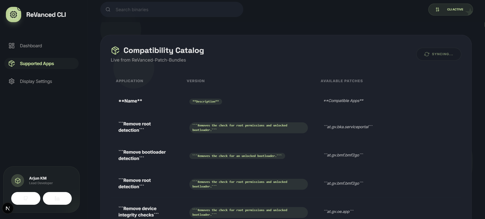
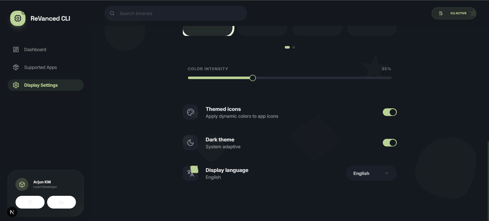
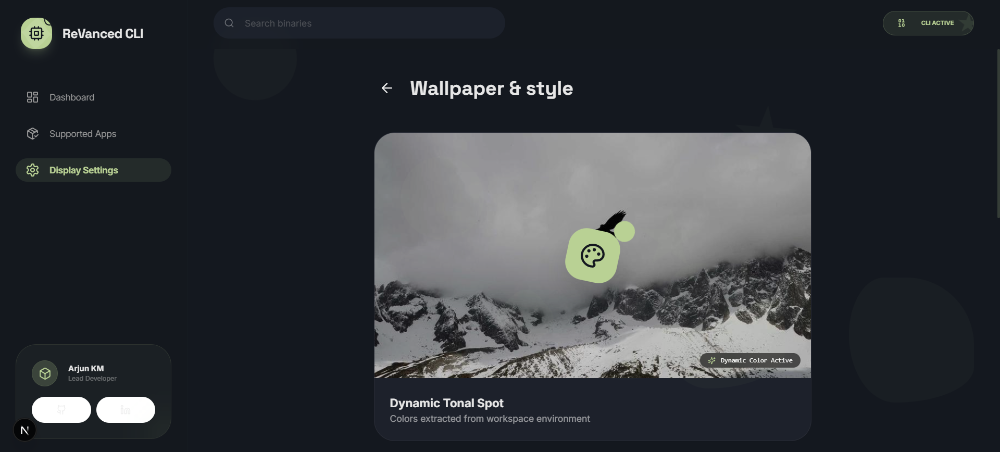

<h1 align="center">ReVanced CLI</h1>

<p align="center">
Material 3 Expressive Windows frontend for ReVanced CLI with real PowerShell patch execution.
</p>

<p align="center">
  
  
  
  
</p>

---

# ReVanced CLI

ReVanced CLI is a modern Windows desktop frontend built for the official ReVanced CLI patching workflow.  
The application provides a clean Material 3 Expressive interface while executing real patching operations through PowerShell in the background.

This project is designed to feel like a native Google Pixel developer tool for Windows.

---

# Features

- Real PowerShell patch execution
- Live terminal logs
- Material 3 Expressive UI
- Windows 10/11 optimized layout
- Automatic supported app synchronization
- Background patch processing
- Local-only execution
- Dynamic dark/light/system themes
- Responsive desktop experience
- GitHub-powered supported app catalog

---

# Screenshots

## Dashboard



---

## Supported Applications



---

## Theme Settings



---

## Wallpaper & Dynamic Styling



---

# How It Works

The application acts as a desktop wrapper around the official ReVanced CLI workflow.

Users provide:

- `revanced-cli.jar`
- `patches.rvp`
- `input.apk`

The application then executes:

```powershell
java -jar revanced-cli.jar patch -p patches.rvp -o patched.apk input.apk
```

through PowerShell while streaming live logs directly inside the desktop interface.

---

# Requirements

## Windows

- Windows 10 or Windows 11

## Java Runtime

Install Java 11 or newer:

https://www.azul.com/downloads/?version=java-11-lts&package=jre#zulu

---

# Required Files

Users must provide:

| File | Description |
|---|---|
| revanced-cli.jar | Official ReVanced CLI |
| patches.rvp | ReVanced patch bundle |
| input.apk | APK file to patch |

---

# Supported Applications

The supported application catalog is automatically synchronized from:

https://github.com/Jman-Github/ReVanced-Patch-Bundles

The application checks the repository and updates compatibility information when syncing.

---

# Installation

## Clone Repository

```bash
git clone https://github.com/4rjunKM/revanced-cli-desktop.git
```

## Install Dependencies

```bash
npm install
```

## Run Development Environment

```bash
npm run tauri dev
```

---

# Build Application

```bash
npm run tauri build
```

Compiled binaries will be generated inside:

```txt
src-tauri/target/release/
```

---

# Project Structure

```txt
revanced-cli-desktop/
│
├── assets/
├── docs/
├── src/
├── src-tauri/
│
├── README.md
├── package.json
└── tauri.conf.json
```

---

# Tech Stack

| Technology | Purpose |
|---|---|
| Tauri | Desktop runtime |
| Next.js | Frontend framework |
| Tailwind CSS | Styling |
| TypeScript | Application logic |
| PowerShell | Patch execution |
| Rust | Native backend integration |

---

# Design Philosophy

The interface is inspired by:

- Google Material 3 Expressive
- Windows 11 desktop applications
- Google Pixel system applications
- Android Studio tooling aesthetics

The focus is on:
- smooth animations
- responsive layouts
- native-feeling interactions
- professional desktop usability

---

# Developer

## Arjun KM

- GitHub: https://github.com/4rjunKM
- LinkedIn: https://www.linkedin.com/in/arjunkm2005

---

# Credits

- ReVanced Team
- ReVanced CLI
- ReVanced Manager
- ReVanced Patch Bundles

---

# Disclaimer

This project is an independent frontend utility and is not affiliated with or endorsed by the official ReVanced Team.

Users are responsible for complying with the terms and licensing of the applications they patch.

---

# License

MIT License
